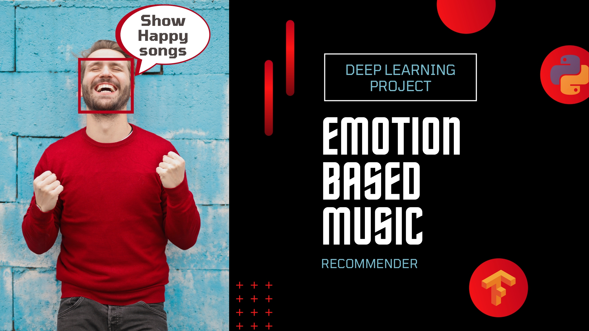

# emotion-based-music
<h1>Explaination Video</h1>
<a href="https://youtu.be/uDzLxos0lNU">Emotion based music | ai | deep learning project | with code | ml project</a>

<h1>Description</h1>
Welcome to new project emotion based music built by using mediapipe and keras. also opencv and streamlit is used to create a webapp. for capturing the webcam in the browser i used streamlit-webrtc module. I explained all of the code in this video which is required to create a webapp for emotion based music recommender.
  
In this video I used live emoji project code to create a model which could classify different emotions so I already explained the code for that which is over here
 Data Collection script : https://youtu.be/ZxZSGRdTLtE
 Data Training and Inference script : https://youtu.be/He_oZ-MnIrU
 Code for live emoji : https://github.com/Pawandeep-prog/liveEmoji
  Project report : https://drive.google.com/file/d/1BFT8fSAPwni2oDMzHhHn98zQsVd67H6Y/view
  Synopsis : https://drive.google.com/file/d/1ECiUT853riHfl0NZnwAv5uClfmBzxVoR/view

<h1>Connect with me</h1>
If you have any queries regarding any of the topic I discussed in this video feel free to talk to e using below links: 
facebook : https://www.facebook.com/mohdshahnawaz.mohdshahnwaz.1 
instagram : https://instagram.com/mohd.s_hahnawaz?igshid=NTc4MTIwNjQ2YQ== 
twitter : https://twitter.com/MohdSha49691418?t=NL3YzH-QU3qowue9LGeonA&s=09 
github : https://github.com/d2oshahnawaz 
telegram : http://t.me/techeducationworldTEW 
linkedin : https://www.linkedin.com/in/mohd-shahnawaz-645371205 
youtube : https://www.youtube.com/@mohdshahnawaz2 
